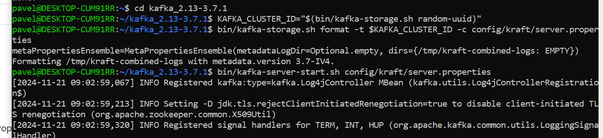
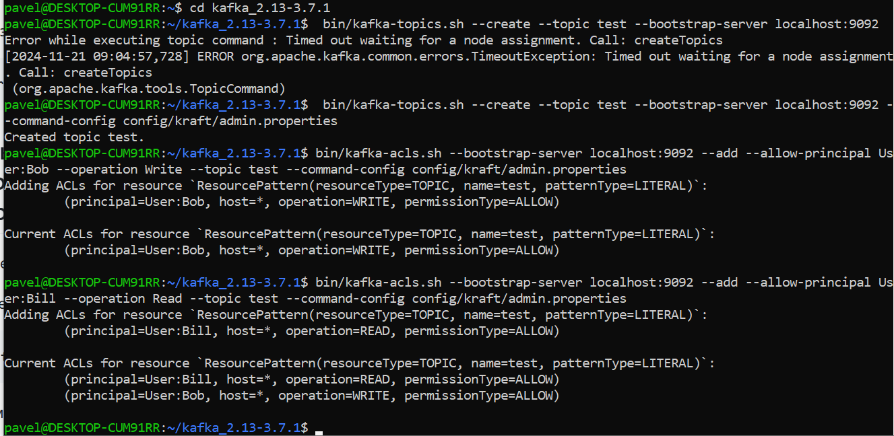
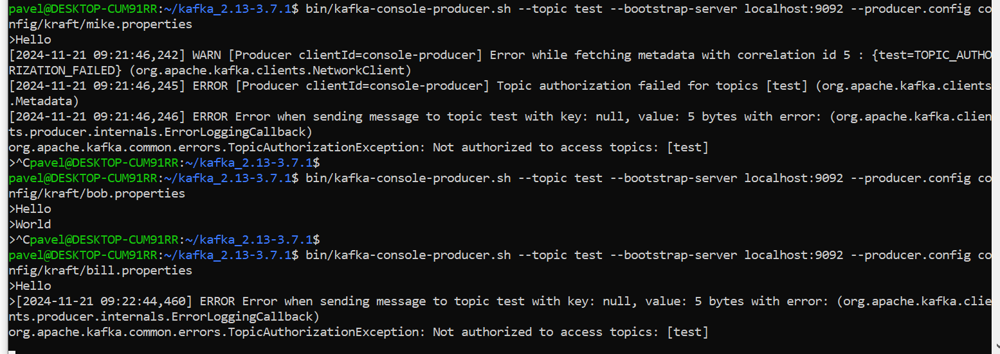
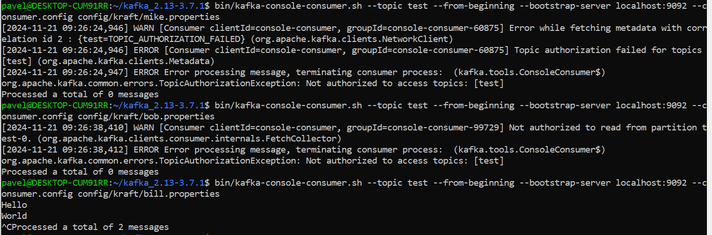

Домашнее задание №2

1. Запускаем kafka + kraft 

2. Настраиваем аутентификацию SASL/PLAIN и создаём 3-х пользователей 
3. Настроиваем авторизацию и создаём топик с использованием конфигурационного файла. Одному пользователю выдаём права на запись в этот топик. Другому пользователю выдаём права на чтение этого топика. Третьему пользователю не выдаваём никаких прав на этот топик.
4. Выполняем команды от всх пользователей  